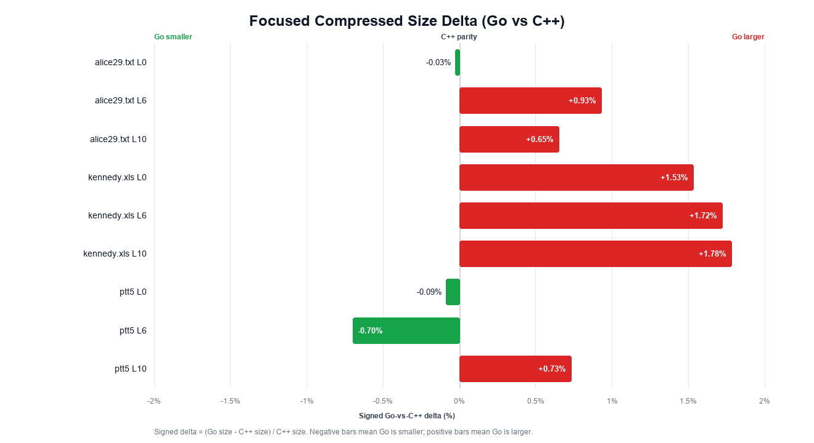
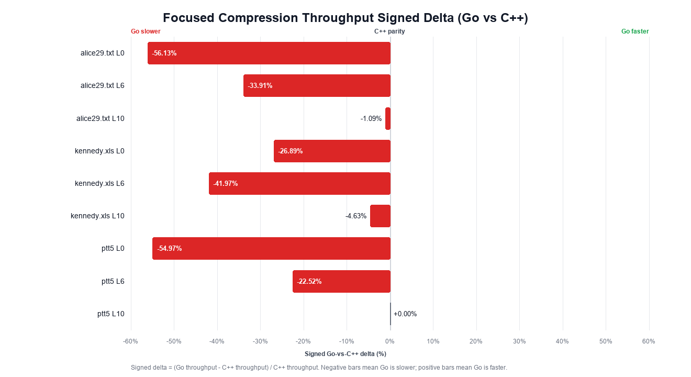
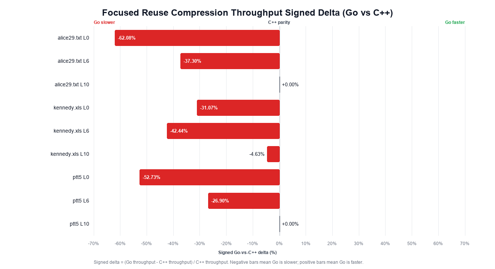
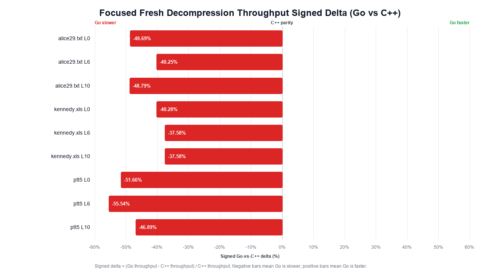
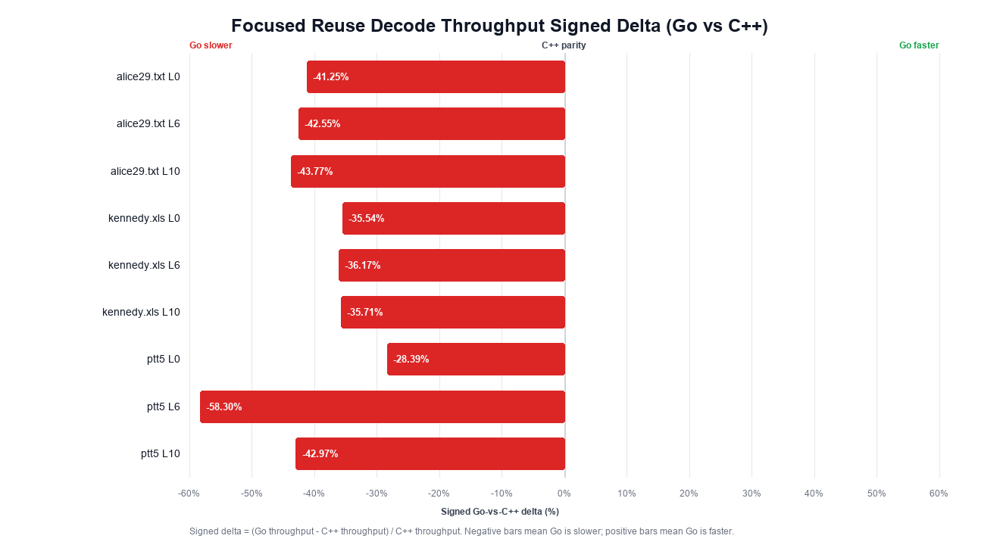

# Skanda Go Verification Report

Generated on 2026-06-14, Asia/Shanghai.

## Scope

This report summarizes local verification evidence for the pure Go Skanda v1.0 implementation against the C++ reference implementation at `Calorado/Skanda` commit `650b34b17a25b89024b7d19820c17c95a9d7591c`.

The compatibility target is Skanda v1.0 stream compatibility: a stream produced by either implementation must decode to the original bytes with the other implementation. Byte-for-byte identical compressed output is not required because the format permits multiple valid encodings for the same input.

The Skanda v1.0 stream format does not store the decompressed size, checksum, dictionary identifier, or streaming frame metadata. Callers must provide the decompressed size to the decoder. Applications that need integrity checks should wrap Skanda data in an external checksum or authenticated container.

## Readiness Decision

Current status: **format-compatible local validation candidate; C++ throughput parity is not achieved yet**.

The current build passes the refreshed Canterbury all-level matrix and completes the focused C++/Go performance comparison in this report. It includes correctness fixes and performance optimizations for reusable encoder and decoder scratch, Huffman decoding, LZ decoding, compression scratch reuse, optimal-parser match buffering, low-bias high-level parsing, optimal1 block splitting, entropy-cost lookup, match-finder hashing, length-stream classification, raw-literal decode fast paths, and level 0 repeat-distance fast paths.

The current build still does **not** meet C++ throughput parity on the focused benchmark rows. Production replacement requires additional release gates: Silesia and enwik8 reruns with this exact build, representative production corpus validation, historical compressed artifact validation, long-duration fuzzing, stable performance and memory thresholds, and shadow rollout evidence with zero decoded-byte mismatches.

## Go and C++ Comparison

### Version and Build Baseline

| Item | C++ reference | Go implementation |
|---|---|---|
| Source identity | `Calorado/Skanda` commit `650b34b17a25b89024b7d19820c17c95a9d7591c` | Current pure Go module in this workspace |
| Runtime/compiler | Apple clang version 16.0.0 (clang-1600.0.26.6) | `go version go1.24.1 darwin/arm64` |
| Build flags | `-O2` | Default `go build` settings |
| Host | `Darwin 24.6.0 arm64`, Apple M4 Max | Same host |
| Focused performance command | `PERF_ITERATIONS=50 LEVELS='0 6 10' BIASES='0.05' ./scripts/perf_compare.sh ...` | Same command |
| Focused performance artifact | `verification_artifacts/perf-compare-focused-optimized.csv` | Same artifact |

The focused performance comparison uses three Canterbury inputs (`alice29.txt`, `kennedy.xls`, `ptt5`), levels `0`, `6`, and `10`, bias `0.05`, and 50 iterations per row.

### Functional Comparison

| Capability | C++ reference used in this report | Go implementation | Current status |
|---|---|---|---|
| Skanda v1.0 stream decoding | Whole-buffer decompression into caller-provided output size | `Decompress` and `Decode` require caller-provided output size | Compatible on tested matrices |
| Skanda v1.0 stream encoding | Whole-buffer compression with level and decode-speed bias | `Compress` and `Encode` with `WithLevel` and `WithDecSpeedBias` | Compatible on tested matrices |
| Compression levels | Levels `0..10` | Levels `0..10` | Covered by refreshed Canterbury matrix |
| Decode-speed bias values | Reference encoder accepts a public bias range | Go clamps the public range and was tested at `1.0`, `0.5`, and `0.05` | Covered by refreshed Canterbury matrix |
| Cross implementation compatibility | C++ stream can be decoded by Go | Go stream can be decoded by C++ | Pass on tested matrices |
| Byte-for-byte compressed output identity | Not required by the format target | Not guaranteed | Different valid streams are accepted when both decode to the original bytes |
| Embedded decompressed size | Not stored in Skanda v1.0 stream | Not stored in Skanda v1.0 stream | Caller must provide size |
| Embedded checksum | Not part of Skanda v1.0 stream | Not part of the Go baseline stream | External integrity wrapper required if needed |
| Dictionary and streaming frame metadata | Not part of the tested baseline | Not part of the Go baseline API | Out of scope for this baseline |

### Compression Ratio Comparison

Current-build Canterbury all-level results stay within the `3%` positive compressed-size gate:

| Dataset | Level/bias coverage | Maximum positive Go-vs-C++ size delta | Largest positive case | Gate |
|---|---:|---:|---|---:|
| Canterbury, current build | 363 pairs | `+1.7823%` | `kennedy.xls`, level `10`, bias `0.05` | Pass `3%` |

Archived Silesia and enwik8 evidence remains useful compatibility history, but those larger gates must be rerun before release with the current build:

| Dataset | Artifact | Maximum positive Go-vs-C++ size delta in artifact | Release status |
|---|---|---:|---|
| Silesia archived | `verification_artifacts/silesia-all-levels-matrix.csv` | `+2.3233%` | Rerun required for current build |
| enwik8 archived | `verification_artifacts/enwik8-level10-bias005-matrix.csv` | `+0.0134%` | Rerun required for current build |

The size-delta data is not one-way degradation. Across the available matrices:

| Dataset | Go larger | Go smaller | Equal | Total pairs |
| --- | ---: | ---: | ---: | ---: |
| Canterbury | 205 | 98 | 60 | 363 |
| Silesia archived | 199 | 194 | 3 | 396 |
| enwik8 archived | 1 | 0 | 0 | 1 |
| Generated edge corpus | 49 | 90 | 1106 | 1245 |

Focused performance sample compressed-size rows:

| Input | Level | Bias | C++ size | Go size | Go-vs-C++ delta |
| --- | ---: | ---: | ---: | ---: | ---: |
| `alice29.txt` | 0 | 0.05 | 60539 | 60520 | `-0.03%` |
| `alice29.txt` | 6 | 0.05 | 50813 | 51284 | `+0.93%` |
| `alice29.txt` | 10 | 0.05 | 49627 | 49951 | `+0.65%` |
| `kennedy.xls` | 0 | 0.05 | 88627 | 89981 | `+1.53%` |
| `kennedy.xls` | 6 | 0.05 | 78692 | 80042 | `+1.72%` |
| `kennedy.xls` | 10 | 0.05 | 58184 | 59221 | `+1.78%` |
| `ptt5` | 0 | 0.05 | 57969 | 57915 | `-0.09%` |
| `ptt5` | 6 | 0.05 | 45464 | 45148 | `-0.70%` |
| `ptt5` | 10 | 0.05 | 41483 | 41786 | `+0.73%` |

Focused sample summary:

| Metric | Value |
|---|---:|
| Compression size delta range | `-0.70%` to `+1.78%` |
| Average compression throughput delta, Go vs C++ | `-26.90%` |
| Compression throughput delta range, Go vs C++ | `-56.13%` to `+0.00%` |
| Average reuse compression throughput delta, Go vs C++ | `-28.57%` |
| Reuse compression throughput delta range, Go vs C++ | `-62.08%` to `+0.00%` |
| Average fresh decompression throughput delta, Go vs C++ | `-45.25%` |
| Fresh decompression throughput delta range, Go vs C++ | `-55.54%` to `-37.58%` |
| Average reuse decode throughput delta, Go vs C++ | `-40.52%` |
| Reuse decode throughput delta range, Go vs C++ | `-58.30%` to `-28.39%` |

| Input | Level | Size delta | Compress delta | Compress reuse delta | Fresh decompress delta | Reuse decode delta |
|---|---:|---:|---:|---:|---:|---:|
| alice29.txt | 0 | `-0.03%` | `-56.13%` | `-62.08%` | `-48.69%` | `-41.25%` |
| alice29.txt | 6 | `+0.93%` | `-33.91%` | `-37.30%` | `-40.25%` | `-42.55%` |
| alice29.txt | 10 | `+0.65%` | `-1.09%` | `+0.00%` | `-48.79%` | `-43.77%` |
| kennedy.xls | 0 | `+1.53%` | `-26.89%` | `-31.07%` | `-40.28%` | `-35.54%` |
| kennedy.xls | 6 | `+1.72%` | `-41.97%` | `-42.44%` | `-37.58%` | `-36.17%` |
| kennedy.xls | 10 | `+1.78%` | `-4.63%` | `-4.63%` | `-37.58%` | `-35.71%` |
| ptt5 | 0 | `-0.09%` | `-54.97%` | `-52.73%` | `-51.66%` | `-28.39%` |
| ptt5 | 6 | `-0.70%` | `-22.52%` | `-26.90%` | `-55.54%` | `-58.30%` |
| ptt5 | 10 | `+0.73%` | `+0.00%` | `+0.00%` | `-46.89%` | `-42.97%` |

### Performance Comparison

Throughput deltas use `(Go throughput - C++ throughput) / C++ throughput`. A `0%` delta means throughput parity with C++; negative values mean Go is slower and positive values mean Go is faster. The performance charts use these signed deltas directly. In the raw focused CSV, the legacy `*_speed_pct` fields remain for threshold checks, while `*_speed_delta_pct` fields are the signed values used by the report tables and charts.

The fresh decompression rows allocate an output buffer for every iteration on both implementations. The reuse compression and reuse decode rows use caller-provided output buffers on both implementations. Go exposes reusable paths through `Encode` and `Decode`, and reusable internal scratch through `Encoder` and `Decoder`.

Compression throughput on the focused sample:

| Input | Level | C++ MB/s | Go MB/s | Go-vs-C++ speed delta |
| --- | ---: | ---: | ---: | ---: |
| `alice29.txt` | 0 | 426.49 | 187.08 | `-56.13%` |
| `alice29.txt` | 6 | 21.50 | 14.21 | `-33.91%` |
| `alice29.txt` | 10 | 0.92 | 0.91 | `-1.09%` |
| `kennedy.xls` | 0 | 992.20 | 725.41 | `-26.89%` |
| `kennedy.xls` | 6 | 60.69 | 35.22 | `-41.97%` |
| `kennedy.xls` | 10 | 1.08 | 1.03 | `-4.63%` |
| `ptt5` | 0 | 1740.94 | 783.89 | `-54.97%` |
| `ptt5` | 6 | 76.65 | 59.39 | `-22.52%` |
| `ptt5` | 10 | 1.06 | 1.06 | `+0.00%` |

Reuse compression throughput on the focused sample:

| Input | Level | C++ MB/s | Go MB/s | Go-vs-C++ speed delta |
| --- | ---: | ---: | ---: | ---: |
| `alice29.txt` | 0 | 518.02 | 196.45 | `-62.08%` |
| `alice29.txt` | 6 | 22.17 | 13.90 | `-37.30%` |
| `alice29.txt` | 10 | 0.91 | 0.91 | `+0.00%` |
| `kennedy.xls` | 0 | 995.64 | 686.31 | `-31.07%` |
| `kennedy.xls` | 6 | 60.48 | 34.81 | `-42.44%` |
| `kennedy.xls` | 10 | 1.08 | 1.03 | `-4.63%` |
| `ptt5` | 0 | 1679.72 | 793.93 | `-52.73%` |
| `ptt5` | 6 | 81.08 | 59.27 | `-26.90%` |
| `ptt5` | 10 | 1.06 | 1.06 | `+0.00%` |

Fresh decompression throughput on Go-produced streams in the focused sample:

| Input | Level | C++ MB/s | Go MB/s | Go-vs-C++ speed delta |
| --- | ---: | ---: | ---: | ---: |
| `alice29.txt` | 0 | 1769.15 | 907.80 | `-48.69%` |
| `alice29.txt` | 6 | 1620.99 | 968.55 | `-40.25%` |
| `alice29.txt` | 10 | 1759.70 | 901.13 | `-48.79%` |
| `kennedy.xls` | 0 | 2317.91 | 1384.17 | `-40.28%` |
| `kennedy.xls` | 6 | 1660.41 | 1036.43 | `-37.58%` |
| `kennedy.xls` | 10 | 1985.80 | 1239.52 | `-37.58%` |
| `ptt5` | 0 | 4975.03 | 2404.78 | `-51.66%` |
| `ptt5` | 6 | 6071.41 | 2699.22 | `-55.54%` |
| `ptt5` | 10 | 5311.97 | 2821.21 | `-46.89%` |

Reuse decode throughput on Go-produced streams in the focused sample:

| Input | Level | C++ MB/s | Go MB/s | Go-vs-C++ speed delta |
| --- | ---: | ---: | ---: | ---: |
| `alice29.txt` | 0 | 1761.34 | 1034.82 | `-41.25%` |
| `alice29.txt` | 6 | 1781.06 | 1023.29 | `-42.55%` |
| `alice29.txt` | 10 | 1728.17 | 971.82 | `-43.77%` |
| `kennedy.xls` | 0 | 2358.56 | 1520.32 | `-35.54%` |
| `kennedy.xls` | 6 | 1715.66 | 1095.13 | `-36.17%` |
| `kennedy.xls` | 10 | 2075.65 | 1334.47 | `-35.71%` |
| `ptt5` | 0 | 4848.44 | 3471.80 | `-28.39%` |
| `ptt5` | 6 | 5830.62 | 2431.41 | `-58.30%` |
| `ptt5` | 10 | 5764.04 | 3287.23 | `-42.97%` |

The focused performance result supports this interpretation:

- Compression ratio remains within the refreshed Canterbury public-corpus gate and within `+1.78%` on the focused sample.
- Level 10 low-bias compression throughput remains the closest focused compression case to C++; level 0 and level 6 keep the largest remaining focused compression gaps.
- Go fresh compression averages `200.91` MB/s and reusable compression averages `198.63` MB/s on the focused sample.
- Fresh Go compression uses a sampled output-capacity hint for initially empty output buffers: fresh Go compression averages `550886` bytes/op, while reusable Go compression averages `410904` bytes/op.
- Level 10 package-merge Huffman code generation and multi-arrival backtracking reuse bounded workspaces. On the focused sample, level 10 fresh compression allocation averages `1296804` bytes/op and reusable compression allocation averages `1023050` bytes/op.
- Go fresh decompression averages `1595.87` MB/s and reuse decode averages `1796.70` MB/s on the focused sample. Decode throughput remains materially below C++ overall on this focused run.

## Implementation Notes

The current implementation includes these compatibility and performance changes:

- Huffman header stream-size delta encoding promotes the signed 16-bit delta to `int` before zig-zag folding, matching C++ integer-promotion behavior.
- Decode scratch buffers are reused within a `Decode` call for RLE, Huffman, and advanced-distance streams.
- Standalone `Decode` uses a bounded shared decoder workspace for outputs up to 16 MiB, reducing fresh-call scratch allocation while avoiding shared retention for larger outputs.
- Huffman decoding builds the full decode table in place, stores packed decode entries, reuses the decode table across streams, and fills repeated table entries with unrolled fast paths for small and larger repeats.
- Huffman renormalization in the symbol loop uses value returns instead of pointer mutation and error-object returns, keeping corrupt-stream checks while reducing hot-loop overhead.
- Huffman symbol decoding writes each 30-symbol output batch through a bounded local slice, reducing per-symbol output bounds checks while preserving the same six-stream decode order.
- LZ decoding separates standard-distance and advanced-distance block loops and uses raw-literal fast paths when the literal stream has no positional mask or delta transform.
- The decode dispatcher enters the common raw-literal and delta-literal LZ block decoders directly after entropy decoding, avoiding the generic literal-stream reconstruction path when block flags identify those common modes.
- Advanced raw-literal LZ decoding uses a single-byte length fast path when the block length stream contains no multi-byte length markers, preserving the existing decoder path for blocks that need extended length encodings.
- Advanced delta-literal LZ decoding uses the same single-byte length fast path when the length stream contains no multi-byte length markers, preserving the generic decoder path for extended length encodings.
- Length-stream classification skips common sixteen-byte groups whose high bits are all clear, then falls back to the exact `>223` marker check for groups containing high-bit values; the decoder path selection is unchanged.
- Advanced delta-literal LZ decoding uses a dedicated path for single-stream delta literal blocks, avoiding the generic literal copier in that hot decode mode while preserving the same distance and length validation; empty literal runs skip literal-bound checks and non-empty runs use bounded slices for reconstruction.
- Advanced delta-literal LZ decoding computes the reference position once per literal run on both generic and single-byte length paths, reducing repeated distance arithmetic in the small literal-run cases while preserving the same corrupt-stream checks.
- Delta-literal reconstruction uses an eight-byte unrolled forward loop on longer literal runs, preserving overlap semantics because bytes are reconstructed in increasing output order.
- Advanced-distance decoding keeps the bitstream state, bit count, and compressed position in local values during the token loop, then writes the compressed position back after validating the final bit count.
- Advanced-distance LZ decoders read decoded distance entries only when a token selects a new distance, avoiding per-token distance-stream reads for repeat-distance matches while preserving corrupt-stream validation.
- Advanced-distance LZ decoders keep only the three repeat distances selected by the token format, avoiding maintenance of an unused fourth repeat state.
- Advanced raw-literal LZ decoding handles the current repeat distance as a direct fast path in both length decoders, preserving repeat-distance update semantics while reducing dispatch in the common raw-literal match loop.
- Advanced delta-literal LZ decoding handles the current repeat distance as a direct fast path in the generic and single-byte length decoders, preserving repeat-distance update semantics while reducing dispatch in the common delta-literal match loop.
- Advanced raw-literal LZ decoding bounds output to the current block slice and writes one-to-six-byte literal runs directly, while delta-literal LZ decoding keeps direct one-to-four-byte reconstruction; both paths keep token exhaustion checks in the loop condition and preserve corrupt-stream validation.
- Raw-literal LZ decoding writes one-to-six-byte literal runs directly and keeps the runtime copy path for longer runs, preserving the same literal bounds checks before copying.
- Standard-distance LZ decode keeps the current repeat distance in a local variable and writes it back once per block instead of updating shared state after every match.
- LZ match copy assumes the positive match lengths already validated by the block decoder, avoiding an unreachable branch in the inlined hot path.
- RLE entropy decode fills repeated symbols with doubling copies instead of a byte-at-a-time loop.
- Compression packs advanced-distance payload bits as they are produced instead of building an intermediate record slice and packing it in a second pass.
- Advanced-distance bit packing writes extra payload bits through an already-checked append path, preserving the emitted bitstream while avoiding repeated nil and mode checks on compression hot paths.
- Compression appends entropy streams directly into the block output buffer on the main paths, reducing temporary stream slices and block-level copies.
- Optimal compression builds the final output cost model from the LZ streams already materialized for output when Huffman parser costs are active, avoiding a second literal/token/distance/length stream materialization while preserving the no-Huffman cost path.
- Huffman headers are encoded into a stack buffer before appending to the compressed stream, avoiding a temporary header slice on the compression path.
- Level 10 package-merge Huffman code generation reuses a bounded workspace for package-merge nodes and pointer lists, preserving code-length selection while avoiding repeated large temporary allocations.
- Level 10 multi-arrival parsing reuses a bounded backtrack-step scratch buffer, avoiding per-backtrack step-slice allocation while preserving parser decisions and output step order.
- Fast Huffman code generation stores the fixed-point log2 fractional table at package scope, preserving code-length decisions while avoiding hot-path table setup work.
- Huffman entropy encoding reuses the histogram collected while checking RLE eligibility on the default Huffman path, avoiding a second input scan for non-RLE streams.
- Huffman stream packing expands the five-symbol fast loop and keeps bit-writer state in local values, preserving stream order while avoiding closure dispatch in the entropy encoder hot path.
- Ultra-fast compression uses full-size LZ blocks to reduce block-boundary overhead on level 0 while keeping the standard raw-block fallback check.
- Ultra-fast compression uses striped Huffman histograms for block entropy streams, reducing histogram dependency chains on the level 0 path while keeping the higher-level parser paths on the default entropy encoder.
- The striped entropy path detects all-same payloads from the collected histogram for large streams, avoiding a separate RLE pre-scan before Huffman cost estimation.
- Ultra-fast compression uses the ordinary entropy encoder for sub-1 KiB streams, avoiding striped-histogram setup overhead on small payloads while preserving the same entropy format.
- `Encode` appends compressed output into caller-provided buffers so production callers can reuse output capacity instead of allocating a fresh compressed slice per call.
- Standalone `Encode` and `Compress` use a sampled output-capacity hint for initially empty output buffers. Levels `0..6` use a tighter compressible-input hint, reducing fresh-call output over-allocation on compressible inputs while keeping the full bound for high-entropy samples.
- Standalone `Encode` and `Compress` reuse a bounded shared encoder workspace for medium-sized inputs, reducing fresh-call allocation pressure while avoiding shared retention for tiny and very large inputs.
- `Encoder` and `Decoder` provide reusable internal scratch for repeated calls; compression stream buffers, optimal parser states, optimal match steps, match-finder tables, and block-splitter tables are reused or pooled where safe.
- Reusable compression preallocates literal scratch for the current block, grows raw and delta literal slices directly, and skips literal-buffer work for empty literal runs after emitting the required token metadata.
- Literal delta streams are written directly while collecting literal runs, avoiding a raw-copy-then-adjust pass for the non-positional literal mode.
- Short non-positional literal runs in preallocated compression scratch write raw and delta bytes together, reducing level 0 literal-collection overhead without changing literal-mode selection.
- Level 0 preallocated literal collection writes five-to-eight-byte raw and delta literal runs directly on the ultra-fast hash6 path, preserving literal-mode selection while reducing short-run collection overhead.
- Level 0 ultra-fast repeat-match encoding writes the common one- and two-byte repeat literal runs directly into raw and delta literal scratch, and writes common match lengths directly into the current token while preserving the generic fallback for other cases.
- Positional-literal sampling uses unrolled histogram collection and caps sampled data at 4096 bytes per block while preserving the sampled byte positions and stream assignment used by the literal-mode estimator.
- Ultra-fast repeat probing inlines the fixed-distance repeat checks for the two candidate positions used by the level 0 repeat loop.
- Ultra-fast repeat probing uses a single-byte precheck to select the next repeat candidate before running full match-length probing, avoiding a second full probe on the common level 0 path.
- Optimal1 compression uses specialized four-entry candidate-bucket update and candidate-enumeration paths for the level 5 and level 6 match finder, preserving candidate order while avoiding generic bucket-shift and loop dispatch in those hot paths.
- The ultra-fast repeat inner loop skips the max-distance and lower-bound checks after the preceding match has already established a legal repeat distance.
- Ultra-fast repeat hash insertion shares the boundary check for the two adjacent positions added after a repeat match.
- Ultra-fast repeat hash insertion derives adjacent-position hashes from one 8-byte load when the full hash window is available.
- Hash match finders avoid repeated window and minimum-length checks after a candidate has already passed the finder validity checks.
- Level 0 hash matching returns match position and length as separate scalar values on the hot path, avoiding construction of a temporary match record while preserving the same hash-table update and match-selection semantics.
- Level 0 ultra-fast hash matching uses a hash6-specialized lookup and adjacent-position insertion path under the fixed level 0 configuration, preserving the generic hash-table update order and using the compression loop's non-negative position invariant while avoiding hot-path hash-window branches.
- Level 0 hash6 candidate validation rejects hash collisions with a six-byte equality mask before computing the exact match length, preserving match selection while avoiding unnecessary trailing-zero work on misses.
- Level 0 advanced repeat-distance matching uses a min-length-4 specialized helper for the two older repeat offsets, preserving distance update semantics while avoiding the generic repeat-match wrapper on the ultra-fast advanced-distance path.
- Level 0 match-finder insertion writes adjacent post-match hash positions from one loaded window when both positions are hashable, preserving the same table write order while reducing repeated hash-window checks.
- Level 0 repeat probing checks the first byte before running full match-length probing after the existing one-byte lookahead adjustment, preserving repeat-match selection while skipping impossible repeat probes.
- Level hash match finders collapse invalid previous-position checks into a single unsigned comparison after the non-negative position guard, preserving candidate rejection semantics while reducing hot-path branching.
- Level hash matching shifts preloaded hash words directly when the configured hash window already discards the unused high bytes, preserving the same hash input while avoiding an unnecessary mask operation on the level 0 and level 1 hot paths.
- Lazy-fast compression uses hash4/hash8 candidate paths that skip repeated boundary and distance checks after the caller has already established the hash window and candidate validity.
- Optimal match-finder updates derive hash3, hash4, and hash8 from a single 8-byte load on positions where the full hash window is available.
- Optimal match finding checks the hash8 candidate before falling back to hash4, avoiding unnecessary hash4 tail comparisons when the hash8 candidate wins.
- Optimal parser repeat-match probing inlines the fixed minimum-length and window checks used by repeat-distance transitions.
- Optimal parser repeat-offset updates use direct branch assignments on the hot path, preserving the same recency ordering while allowing the small update routine to inline at parser call sites.
- Optimal parser candidate relaxation skips match-cost calculation when the destination state already has a cost no greater than the current state, preserving the strict improvement rule because encoded matches always add positive cost.
- OPTIMAL1 parser initialization writes only the reachability cost across the state window; backtracking enters only reachable states, so stale predecessor fields in unreachable states are ignored.
- Optimal cost-model construction reuses compression stream scratch for temporary literal, token, distance, and length streams.
- OPTIMAL1 parser backtracking walks the selected path once, records match steps in reverse order, and reverses only the compact match-step slice before returning it.
- Entropy-cost estimation uses a precomputed `count * log2(count)` table for block-sized histograms.
- Level and block-splitter match finders precompute hash masks and shifts so hot hash calls avoid per-position hash-byte switches.
- Level hash match finders reuse the 8-byte word loaded for hashing as the first match-length comparison when the current block has a full 8-byte window, falling back to the bounded matcher near block ends.
- Match-length probing and match-end checks remove redundant bounds work on internal paths whose callers already prove `back < front` and `limit <= len(src)`.
- Slice-backed scratch pools use bounded channel-backed free lists so releasing a buffer does not allocate a separate slice-header object.
- OPTIMAL2/3 match buffering caps stored matches per position at 4. A lower cap improved speed but failed the Canterbury all-level compression-ratio gate; cap 4 preserves the refreshed `3%` gate.
- Level 10 low-bias parsing uses two parser iterations; higher bias keeps the more conservative iteration count to preserve compression-ratio margin.
- Level 6 uses a smaller optimal chunk, a two-way optimal1 splitter, and a smaller match-finder entry set to reduce parser cost while preserving the Canterbury `3%` gate.

## Verification Results

| Gate | Command or artifact | Result |
|---|---|---:|
| Unit, round-trip, level, literal, distance, and API tests | `go test -count=1 ./...` | Pass |
| Static analysis | `go vet ./...` | Pass |
| Staticcheck | `staticcheck ./...` | Pass |
| Script syntax | `bash -n scripts/*.sh` | Pass |
| Report chart generation | Bundled Python running `scripts/generate_report_charts.py` | Pass; focused performance charts use centered signed deltas |
| Forbidden keyword scan | Repository-wide forbidden keyword scan | Pass |
| Local Go microbench allocation smoke | `go test -run '^$' -bench 'Benchmark(CompressMixed\|DecompressMixed)$' -benchmem -count=8` | Compress `2 allocs/op`; decode `0 allocs/op` |
| Canterbury all-level matrix, current build | `verification_artifacts/canterbury-all-levels-matrix.csv` | Pass `3%` |
| Focused C++/Go performance comparison, current build | `verification_artifacts/perf-compare-focused-optimized.csv` | Completed with ratio fields and signed delta fields |
| Silesia all-level matrix | `verification_artifacts/silesia-all-levels-matrix.csv` | Archived; rerun required for current build |
| enwik8 focused matrix | `verification_artifacts/enwik8-level10-bias005-matrix.csv` | Archived; rerun required for current build |

## Visual Charts

The focused comparison charts under `verification_artifacts/charts/` use signed Go-vs-C++ deltas on a centered `0%` axis. `0%` is C++ parity. Performance chart values are `(Go throughput - C++ throughput) / C++ throughput`: negative values extend left on the Go-slower side and positive values extend right on the Go-faster side. The focused size chart uses `(Go size - C++ size) / C++ size`: negative values extend toward Go-smaller output and positive values extend toward Go-larger output.

| Chart | Data shown |
|---|---|
| `verification_artifacts/charts/compression-size-delta.png` | Maximum positive Go-vs-C++ compressed-size delta for available public corpus artifacts. |
| `verification_artifacts/charts/compression-delta-distribution.png` | Count of Go-larger, Go-smaller, and equal compressed-size pairs by dataset. |
| `verification_artifacts/charts/focused-size-delta-signed.png` | Signed focused sample size deltas; negative bars show Go-smaller outputs. |
| `verification_artifacts/charts/focused-compress-throughput-delta.png` | Signed focused compression throughput deltas; negative bars extend left to Go slower, positive bars extend right to Go faster. |
| `verification_artifacts/charts/focused-compress-reuse-throughput-delta.png` | Signed focused reuse compression throughput deltas with caller-provided output buffers; negative bars extend left to Go slower, positive bars extend right to Go faster. |
| `verification_artifacts/charts/focused-decompress-throughput-delta.png` | Signed focused fresh decompression throughput deltas on Go-produced streams; negative bars extend left to Go slower, positive bars extend right to Go faster. |
| `verification_artifacts/charts/focused-decode-reuse-throughput-delta.png` | Signed focused reuse decode throughput deltas on Go-produced streams; negative bars extend left to Go slower, positive bars extend right to Go faster. |

## Remaining Release Gates

| Gate | Required result |
|---|---|
| Silesia and enwik8 reruns | Current build passes the same mutual-decompression and `3%` positive size-delta gates on larger public corpora. |
| Production corpus | C++/Go mutual-decompression and compression-ratio checks pass on desensitized real payloads covering production size and data-shape distribution. |
| Historical compressed artifacts | Go decodes every still-online C++ compressed artifact and decoded bytes match expected payloads. |
| Long fuzzing | Required fuzz targets run for the release duration with no failures; any discovered crashers are preserved in the seed corpus. |
| Performance SLA | C++ and Go are compared on representative payloads and target hardware with stable throughput, latency, allocation, GC, and peak RSS thresholds. |
| Large-file stress | enwik9 or an equivalent production-sized large-file test completes without OOM and meets the performance/resource SLA. |
| Security/resource limits | Corrupt streams, truncated streams, malformed headers, and decompression-bomb scenarios return controlled errors without panic, OOM, or unbounded CPU use. |
| CI gates | Unit tests, compatibility matrix, static checks, race checks, fuzz smoke, and regression corpus checks are enforced automatically. |
| Shadow rollout | Production C++ path remains authoritative while Go results are compared out of band; decoded-byte mismatch target is zero. |
| Rollback | A caller-level switch or deployment rollback path exists before enabling production write traffic. |

## Conclusion

The current Go implementation is compatible with the Skanda v1.0 stream format on the refreshed Canterbury matrix and focused compatibility/performance checks. The current build keeps reusable compression allocation pressure low and preserves the Canterbury `3%` compression-ratio gate.

The implementation is not yet a fully proven broad production replacement. The remaining blockers are release-grade proof across larger current-build corpora and the remaining C++ throughput gap on representative workloads.
